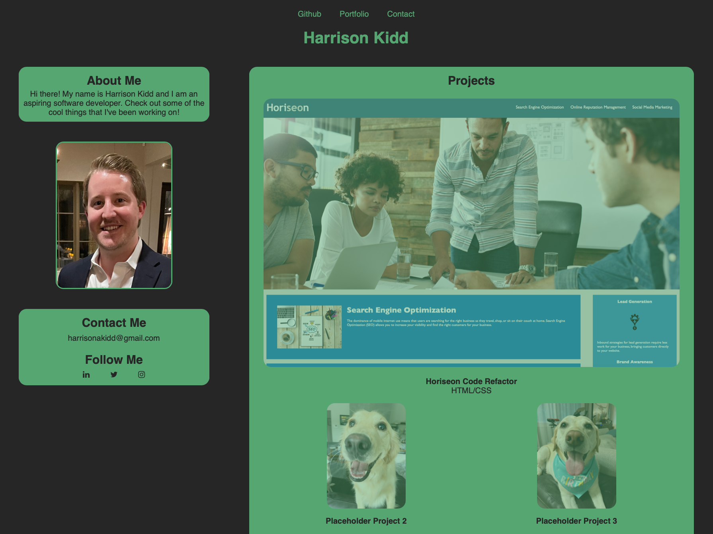
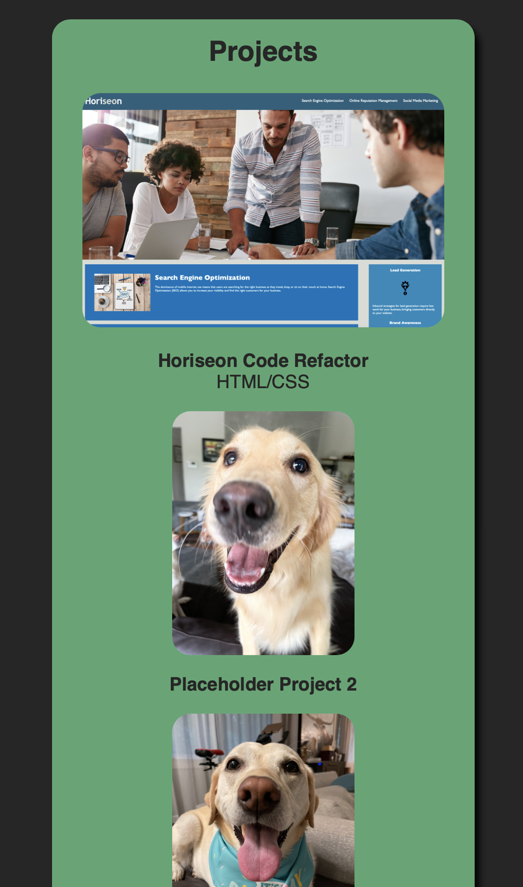

# My Portfolio Website
Homework assignment #2 - Building a portfolio webpage from scratch.

Link to the live page: https://hkidd.github.io/PortfolioWebsite_HK/

## Purpose
The purpose of this website is to showcase my coding capabilities.  At the moment, I don't have much to add (aside from our first assignment and pictures of my dogs), but I plan to continue adding to this website over time.

## Acceptance Criteria
GIVEN I need to sample a potential employee's previous work
WHEN I load their portfolio
THEN I am presented with the developer's name, a recent photo, and links to sections about them, their work, and how to contact them

WHEN I click one of the links in the navigation
THEN the UI scrolls to the corresponding section

WHEN I click on the link to the section about their work
THEN the UI scrolls to a section with titled images of the developer's applications

WHEN I am presented with the developer's first application
THEN that application's image should be larger in size than the others

WHEN I click on the images of the applications
THEN I am taken to that deployed application

WHEN I resize the page or view the site on various screens and devices
THEN I am presented with a responsive layout that adapts to my viewport

## Responsiveness and Design
I've spent quite a bit of time trying to optomize the website for use on both desktop screens as well as mobile screens.

The site has a flatter design on desktop to begin with, as hover effects were employed to add some depth to the different areas depending on where the user moves their cursor.

On mobile, the site starts with a more 3D look since you tend to miss out on the ability to "hover" when using touchscreens.

## Example Images
### Desktop

 

### Mobile  

## External and Internal Links
I have provided links not only to the various sections of the webpage, but also to external sites such as Github, LinkedIn, and Instagram.  This allows for more ways for the user to potentially interact with me.

## License
[MIT](https://choosealicense.com/licenses/mit/)

## Contact
Harrison Kidd

harrisonakidd@gmail.com
