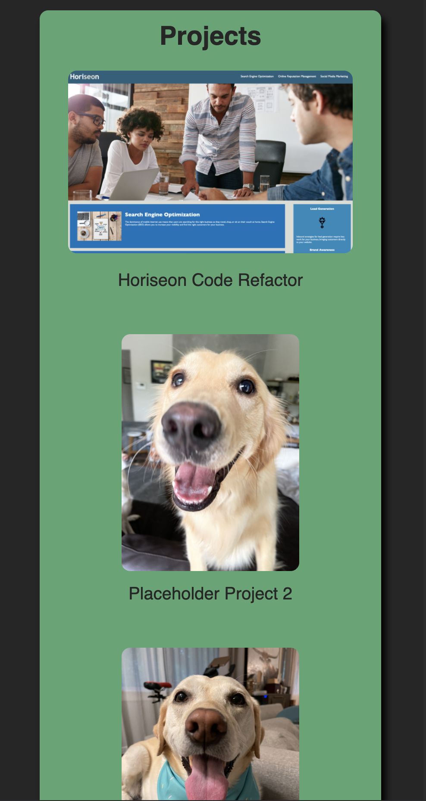

# My Portfolio Website
A website to showcase my coding portfolio.

## Purpose
The purpose of this website is to showcase my coding capabilities.  At the moment, I don't have much to add (aside from our first assignment and pictures of my dogs), but I plan to continue adding to this website over time.

## Responsiveness and Design
I've spent quite a bit of time trying to optomize the website for use on both desktop screens as well as mobile screens.

The site has a flatter design on desktop to begin with, as hover effects were employed to add some depth to the different areas depending on where the user moves their cursor.

On mobile, the site starts with a more 3D look since you tend to miss out on the ability to "hover" when using touchscreens.

## Example Images
### Desktop

 

### Mobile  

## External and Internal Links
I have provided links not only to the various sections of the webpage, but also to external sites such as Github, LinkedIn, and Instagram.  This allows for more ways for the user to potentially interact with me.

Link to the live page: https://hkidd.github.io/PortfolioWebsite_HK/

## License
[MIT](https://choosealicense.com/licenses/mit/)

## Contact
Harrison Kidd

harrisonakidd@gmail.com
